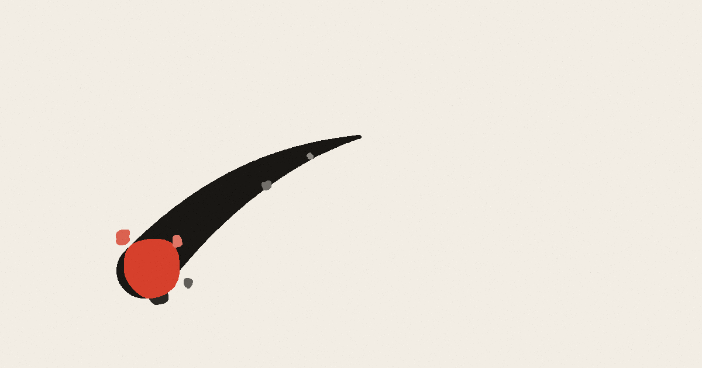

<p align="center">
  
</p>

<h1 align="center">INKBOUND</h1>

<p align="center"><em>Every room paints a picture.</em></p>

<p align="center"><strong><a href="https://inkbound-game.github.io/">▶ Play it in your browser</a></strong></p>

---

A roguelike dash-slayer drawn as a Japanese ink painting. You are a vermilion brush
tip on a blank page. Your dash is your only weapon, and everything you kill stains
the paper permanently — by the end of a floor the room is a painting of the fight
you just had.

## How it plays

You dash *through* enemies to kill them. There is no shooting, no melee button, no
blocking. Every fight is about where you put yourself and when you commit, because
a dash you spend badly is a dash you do not have when something lunges at you.

Runs are five floors. Each floor is a line of rooms with exactly one shop and one
treasure room on it, and **you can never go back** — once you walk through a door it
seals behind you. Side paths branch off the main line and are longer, more dangerous,
and hidden: the door tells you nothing about what is on the other side. They rejoin
the main line one room further along, so taking one always costs you an extra fight.

Shops sell four things and let you buy **one**. Treasure rooms offer two relics and
let you take **one**. There are 284 relics, and they stack — a run that finds the
right three or four of them plays very differently from one that does not.

Twenty-one bosses wait at the ends of the floors: five each on floors one through
four, and a single final one on floor five that cannot be cut at all. You will have
to work out what to do about that when you meet it.

## Controls

| | |
|---|---|
| Move | `W` `A` `S` `D` or arrow keys |
| Dash · slay | `Space` or left click |
| Ink burst | `Shift` or right click |
| Relics · map | `Tab` |
| Pause | `Esc` or `P` |
| Mute | `M` |
| Touch | hold to move, tap to dash |

Aim with the mouse — you dash toward the cursor.

## Running it yourself

The whole game is one HTML file with no build step and no dependencies. Clone the
repo and open `index.html`, or serve the folder:

```bash
python -m http.server 8000
```

Then visit `http://localhost:8000`. A local server is only needed for the offline
install to work; the game itself runs fine straight from the file.

## Installing it

Open the page on a phone and use **Add to Home Screen**. It installs as a normal app,
launches fullscreen with no browser chrome, and works with no connection after the
first load. Progress and unlocks are saved in the browser on the device you play on.

## Built with

Plain HTML, CSS and JavaScript — a canvas, some maths, and a lot of tuning. No engine,
no framework, no external assets. The paper grain, the ink, and every sound effect are
generated at runtime.
